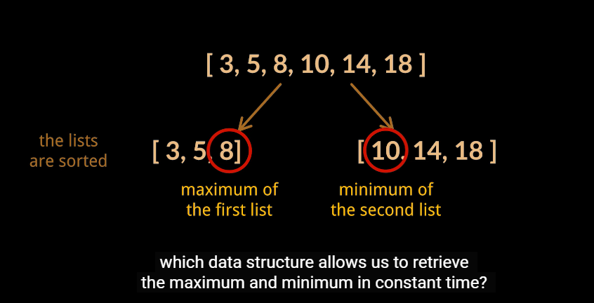

# Phân tích yêu cầu

Thiết kế class với 2 phương thức
- Thêm số addNumber()
- Tìm median của dãy số được thêm vào

### Median là gì?

Giá trị ở giữ của dãy số **đã được sắp xếp**

[1, 5, _6_, 8, 9] -> meidan = 6

[1, 5, _7_, _9_, 11, 13] -> meidan = (7 + 9) / 2 = 8


# Thử với sort

Mảng đầu vào:  arr = [3, 2, 5, 20, 9]

Sort nhẹ nhàng ta được: arr = [2, 3, 5, 9, 20]

- Giá trị median ở mảng có số phần từ là số lẻ: arr[n / 2] = 5
- Giá trị median ở mảng có số phần từ là số chằn:   (arr[n / 2] + arr[(n / 2 ) - 1]) / 2   

### Nếu dễ như vầy thì leetcode đâu để HARD

> At most 5 * 10⁴ calls will be made to addNum and findMedian.

Hàm findMedian sort với O(nlogn), khi gọi findMedian với n = 5 * 10⁴

> 50,000 × 780,000 ≈ 39×10⁹

Rất chậm 

# Giải pháp nào tốt hơn



Theo ảnh minh họa thi median cần tìm là **8** và **10**. Để tìm min và max cho array động thì cấu trúc dự liều phù hợp minHeap và maxHeap.


## 💡 Ý tưởng ở đây là gì?

Với mỗi phần tử được thêm vào sẽ xem xét thêm vào maxHeap hoặc minHeap. Khi nào thêm vào minHeap khi nào thêm vào maxHeap sẽ đào sâu hơn ở phần sau. 

Theo ảnh minh họa ở trên
- Tổng số phần tử là số chẵn: median = (minHeap.peek() + maxHeap.peek()) / 2
- Tổng số phần tửu là số lẻ: median = maxHeap.peek(). ❓ Tại sao không lấy minHeap.peek()?

###  Triển khai minHeap, maxHeap và kiểm tra tín chẵn lẻ
```java
class MedianFinder {
    private Queue<Integer> minHeap;
    private Queue<Integer> maxHeap;
    private boolean isEven;

    public MedianFinder() {
        minHeap = new PriorityQueue<>();
        maxHeap = new PriorityQueue<>(Collections.reverseOrder);
        isEven = true;
    }
}
```

### Triền khai hàm addNum()
```java
class MedianFinder {
    private Queue<Integer> minHeap;
    private Queue<Integer> maxHeap;
    private boolean isEven;

    public MedianFinder() {
        minHeap = new PriorityQueue<>();
        maxHeap = new PriorityQueue<>(Collections.reverseOrder);
        isEven = true;
    }

    public void addNum(int num) {
        if(isEven) {
            maxHeap.offer(num);
            minHeap.offer(maxHeap.poll());
        } else {
            minHeap.offer(num);
            maxHeap.offer(minHeap.poll());
           
        }
        isEven = !isEven;
    }
}
```

Để đảm bảo minHeap và maxHeap cân bằng, khi tổng số phẩn từ là chẵn thêm vào maxHeap - lẻ thêm vào minHeap

🧩 ***Có thể làm ngược lại được không, tổng số phẩn từ là chẵn thêm vào minHeap - lẻ thêm vào maxHeap?***

👉 Tất nhiên là được. Nhưng có khác nhau ở kết qua trả về ở hàm findMedian, sẽ giải thích thêm ở hàm findMedia()

🧩 ***Tại sao sau mỗi lần offer(num) thì chuyển một phần tử sang heap còn lại?***

👉 Để đảm bảo 2 heap cân bằng và num được offer vào nằm ở đúng heap 

👉 Có minHeap và maxHeap như bên dưới với tổng số phần từ là 6 - chẵn
| maxHeap        | minHeap        | 
|----------------|----------------|
| [3, 5 ,8]      | [10, 14, 18]   |

👉 Cần thêm vào số **11**, mà tổng số phần từ là chẵn nên thêm vào maxHeap. Nhưng có gì đó sai sai sô 11 phải nằm sau số 10 của minHeap mới đúng.
| maxHeap        | minHeap        | 
|----------------|----------------|
| [3, 5, 8, 11]  | [10, 14, 18]   |

👉 Do đó lấy từ maxHeap ra phần từ lớn nhất để chuyển sang minHeap. Theo ví dụ này cũng chính là số 11. 
| maxHeap        | minHeap        | 
|----------------|----------------|
| [3, 5, 8]      |[10, 11, 14, 18]|


### Triền khai hàm findMedian()
```java
class MedianFinder {
    private Queue<Integer> minHeap;
    private Queue<Integer> maxHeap;
    private boolean isEven;

    public MedianFinder() {
        minHeap = new PriorityQueue<>();
        maxHeap = new PriorityQueue<>(Collections.reverseOrder);
        isEven = true;
    }

    public void addNum(int num) {
        if(isEven) {
            maxHeap.offer(num);
            minHeap.offer(maxHeap.poll()); // 🔥🔥🔥🔥
        } else {
            minHeap.offer(num);
            maxHeap.offer(minHeap.poll());
        }
        isEven = !isEven;
    }

    public double findMedian() {
        return isEven ? (minHeap.peek() + maxHeap.peek()) / 2.0 : minHeap.peek();
    }
}
```

🧩***Tại sao khi tổng số phân tử là số lẻ return về minHeap.peek()***

👉 Với triền khai như trên khi tổng số phần từ là số lẻ sẽ thêm vào minHeap. Triên khai với 3 - 8 - 7. minHeap.peak() = 7 ✅
| maxHeap        | minHeap        | 
|----------------|----------------|
| [3]            |[7, 8]          |


🧩***Heap nào giữ median khi số lẻ***

👉 Phụ thuộc vào heap nhận giá trị cuối cùng. Trong triển khai ở trên là minHeap 🔥🔥🔥🔥. Nên khi tổng phần từ là số lẻ return về minHeap hoặc ngược lại


### Soure

[https://www.youtube.com/watch?v=756_8C9YBZQ](https://www.youtube.com/watch?v=756_8C9YBZQ)

[https://www.youtube.com/watch?v=SdURPlHqc1gs](https://www.youtube.com/watch?v=SdURPlHqc1gs)


