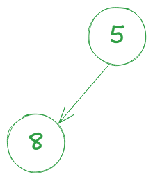
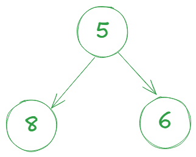
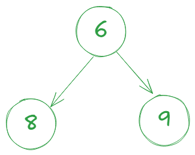
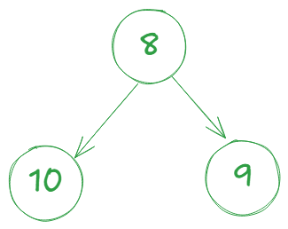

## Understand the problem
Given an integer k and an array scores. Retrun k-th largest score. Design a class return k-th largest score in a stream.

## 🧠 NAVIE SOLUTION
Using array -> sort -> return k-th score scores[size() - k]

## 💡 IDEA
Using minHeap keep the size less than or equal k.
If the new score is less than the heap’s top, do nothing
If it's greater, poll the top and add the new score

[8, 5, 6, 9, 10] -> score 3rd = 8

Keep size of minHeap less than or equal 4

| Action                                                     |       Visualize minHeap       | 
|----------------------------------------------------------  |-------------------------------|
| i = 0  -> socre = 8  -> add(8)                             |    |
| i = 1  -> socre = 5 < minHeap.peek() -> add(5)             |    |
| i = 2  -> socre = 6 < minHeap.peek() -> add(6)             |    |
| i = 3  -> socre = 9 < minHeap.size() -> poll() -> add(9)   |    |
| i = 4  -> socre = 10 < minHeap.size() -> poll() -> add(10) |    |

> minHeap.peek() = 8 that is answer